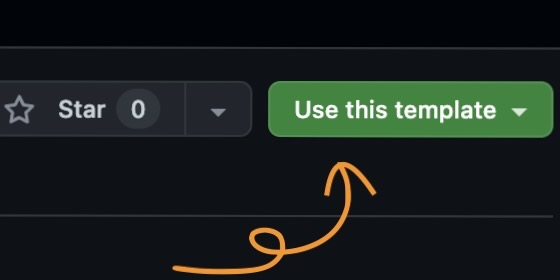

# Astro Starter Kit

<br />

## 🍀 必須環境

- `Node.js` >= v20.12.0
- Package Manager (`npm` or `bun` or `pnpm` or `yarn`)

<br />

## 🔭 使用技術

- [Astro](https://astro.build)

<br />

## 💭 セットアップ

開発を始めるためには依存関係をインストールする必要があります。

```bash
npm install
```

<br />

## 🔧 開発方法

### 開発サーバーの起動

開発サーバーを用いることで、ブラウザで実装をプレビューできます。

```bash
npm run dev
```

### ビルド

本番環境で実行する・デプロイするためには、ビルドを行う必要があります。

```bash
npm run build
```

### 擬似本番サーバーの起動

本番環境のコードを用いて、擬似的に本番環境を再現した開発サーバーを起動することができます。

```bash
npm run preview
```

<br />

## 📁 ディレクトリ構成

```
/
├── .astro/
│
├── .vscode/
│
├── node_modules/
│
├── public/
│   └── favicon.svg
│
├── src/
│   ├── components/
│   │
│   ├── layouts/
│   │
│   ├── pages/
│   │   └── [slug]
│   │   │   └── _
│   │   │   └── index.astro
│   │   └── _
│   │   └── index.astro
│   │
│   └── styles/
│       ├── core
│       └── style
│       └── _index.scss
|       └── global.scss
│
├── astro.config.ts
└── package.json
```

#### `.astro/`

Astro 開発時などのキャッシュを格納するディレクトリです。基本的に触れません。

#### `.vscode/`

VSCode の設定ファイルを格納するディレクトリです。基本的に触れません。

####　`node_modules/`

`npm i` などでインストールされる依存関係が格納されるディレクトリです。
`node_modules` がインストールされていないと開発が行えませんので、存在しない場合は `npm i` などで依存関係をインストールしてください。

#### `public/`

静的ファイルを格納するディレクトリです。
ビルド時には、ディレクトリの中身がそのままデプロイされるので Astro の最適化技術によって変更を加えられて欲しくないファイルなどを格納します。

#### `src/`

ソースコードを格納するディレクトリです。

#### `src/components/`

アプリケーション全体で使用するコンポーネントを格納するディレクトリです。

詳細は [コンポーネント（ドキュメント）](https://docs.astro.build/ja/basics/components) を参照してください。

#### `src/layouts/`

ページ全体のレイアウトを定義するためのコンポーネントを格納するディレクトリです。

詳細は [レイアウト（ドキュメント）](https://docs.astro.build/ja/basics/layouts) を参照してください。

#### `src/pages/`

ページとして扱って欲しい `.astro` ファイルを格納するディレクトリです。

詳細は [ページ（ドキュメント）](https://docs.astro.build/ja/basics/project-structure) を参照してください。

#### `src/pages/_/`

`src/pages/` に格納されているページでしか使用されないコンポーネントやスクリプト、スタイルを格納するディレクトリです。

#### `src/styles/`

見た目に関わるファイルを格納するディレクトリです。

#### `src/styles/core/`

スタイリング時に活用される Mixin や Function, Variable などを定義したファイルを格納するディレクトリです。

#### `src/styles/style/`

スタイルを定義したファイルを格納するディレクトリです。

#### `astro.config.ts`

Astro の設定ファイルです。

#### `package.json`

プロジェクトの依存関係やスクリプトなどが記述されているファイルです。

<br />

## 🚀 新規プロジェクトを開始する

このサンプルコードを用いて新しいプロジェクトを開始したい場合、以下の手順で進めてください。

### 1. Git でリポジトリを作成する

本リポジトリは `Template Repository` として作成されているため、Github 右上の `Use this template` ボタンをクリックして新しいリポジトリを作成してください。



### 2. Git に空のコミットを作成する

```bash
git commit --allow-empty -m "🚀"
```

※ 不要であれば実行しなくても問題ないです。

### 3. README.md を編集する

`README.md` は 開発者がプロジェクトや開発方法についてなどを理解するための重要なドキュメントです。

必要に応じて `README.md` を書き換えて、プロジェクトに関する情報を記述してください。

特に、「🚀 新規プロジェクトを開始する」セクションは、Astro Stater Kit 専用の情報になっているため、削除してください。

また、[`./docs/images`](./docs/images) ディレクトリも不要であれば削除してください。
